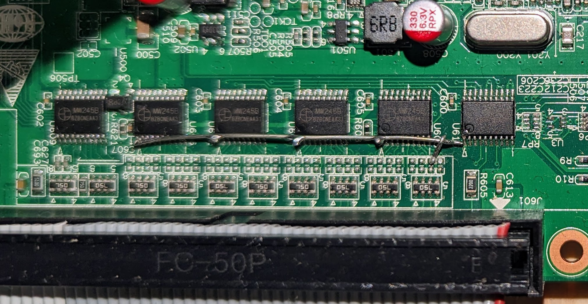
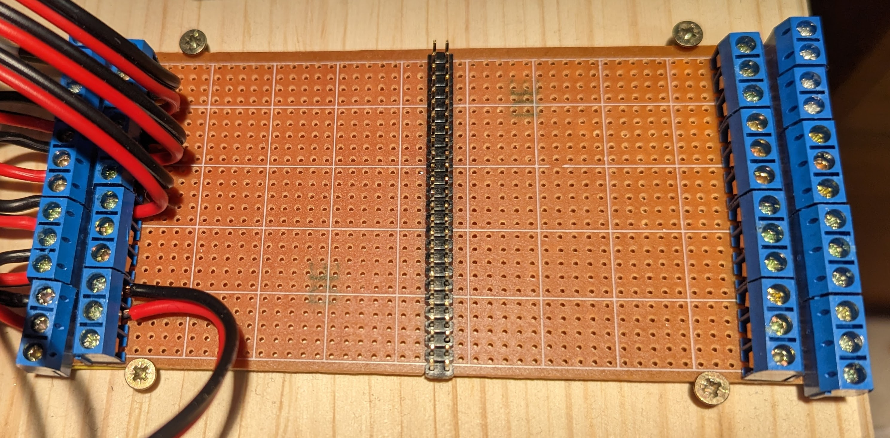
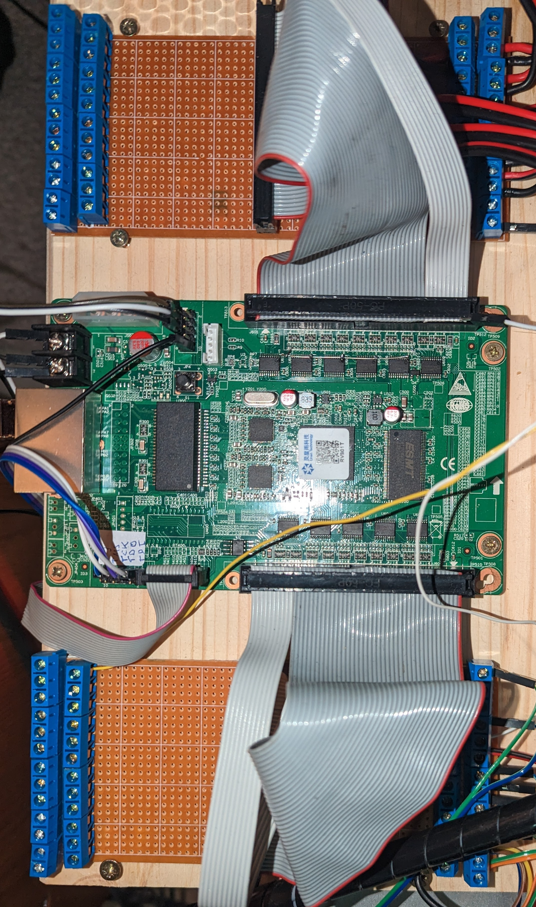

# litehm2

## Overview
This project aims to bring the Linuxcnc HostMot2 code from Mesa Electronics
to more boards. For maximum portability it is based on
[Litex](https://github.com/enjoy-digital/litex) a framework to easily build SoC
on FPGA boards.

The first board we bring hostmot2 to is the linsn rv901t, a low cost board
originally designed to control LEDs, but which is well suited to serve as
a general I/O board. Information about the reverse engineered board can be found
[here](https://github.com/q3k/chubby75/blob/master/rv901t/doc/hardware.md).

## Getting started

There are a few hurdles to take to get up and running.
1. [Do the initial firmware programming](#initial-programming)
2. [Modify the board for input and output](#board-modification)
3. [Build a breakout board](#example-breakout-board)
4. [Rebuild LinxCNC hostmot2 driver](#rebuild-linuxcnc)

If none of the provided configurations fit your needs, you can either open
a ticket to get your configuration included or [build](#building) it yourself.

### Initial Programming

To get started you need to flash or load the first bitstream via external
means. After that, you can use [mesaflash](#mesaflash-patches) or the serial
interface to do updates. For the initial programming you can choose any of the
provided bitstreams.

You can either program the flash directly via header JP5 or via JTAG. A running
litehm2 identifies itself by emitting short flashes with the onboard LED
(green).

Example bitstreams can be found in [bitstreams](bitstreams), where the `.bin`
files are for direct flash programming and the `.bit` files to load via JTAG.

#### Program flash directly

To program the flash directly you need to find an adapter that is supported by
[flashrom](https://www.flashrom.org/Supported_programmers). A cheap option is
an ftdi ft2232h or ft232h based board.

As the SPI header (JP5) has only 2mm spacing, common connectors do not fit.
An easy option is to use Dupont-style jumper cables and remove every other
one from its housing (*TODO: add picture*).

Make sure to connect PROG_B to GND. This instructs the FPGA to release its
SPI interface. You probably also have to reduce the clock rate when using
ftdi(2)232h-based modules using the 'divisor' option (see manpage of flashrom).

The current version of flashrom does not recognize the onboard SPI flash.
Nevertheless programming works.

For initial programming bitstreams/initial.bin should be used. This is a
padded version of litehm2.bin, as flashrom expects the file to be the same
size as the flash to be programmed.

#### Load bitstream via JTAG
The other option is to do the JTAG hack as described
[here](https://github.com/q3k/chubby75/blob/master/rv901t/doc/getting_started/improved_jtag_getting_started.md)
and use [openFPGAloader](https://github.com/trabucayre/openFPGALoader).

openFPGAloader can also be used to program the flash with --write-flash
(untested).
Otherwise you can use mesaflash to do the programming once the bitstream
is loaded.

### Board Modification

The rv901t has 11 bidirectional drivers with 8 ports each, of which 3 are
hardwired to output.
The other 8 can be switched to input or output, but only all at once. So you
basically have two options here:
1. Use 2 boards, one for output, one for input,
2. Modify a board to get a mixture of both.

I have modified my board so that the upper row is always configured as output,
while the bottom row is switched to input via software. The modification is
quite simple. Lift up the direction pins of U603, U607, U602 and U606 (see
[rv901 front annotated](https://github.com/q3k/chubby75/blob/master/rv901t/doc/front_annotated.jpg)) and connect them to ground. You can find ground on any
of the unpopulated resistors, on the side closer to the drivers.

*TODO: the documentation is somewhat inconclusive regarding the shared pins.
Some are marked as shared, but give different driver outputs. check.*

### Example Breakout Board

Because the board already has 5V-compatible inputs and outputs, it is very easy
to build a simple breakout board. The drivers also already add some level of
protection.

I just mounted a 50 pin header to a vero board, cut the strips between the pins
and added 5.08mm pitch screw terminals. This way I get 4 rows of screw
terminals, the outer ones with 13 terminals and the inner ones with 12. The board
is connected to the breakout board with a short ribbon cable with IDC connectors.
Pin one is connected pointing down on each board.

With two breakout boards, one on top of the board and one on bottom, I have a
total of 8 columns of screw terminals. In the configuration file I named them
top-left-outer (tlo), top-left-inner (tli) ... bottom-right-outer (bro).
Pin 1 is always to the bottom.

### Configuration: board.conf

The I/O configuration of the board is defined by [board.conf](board.conf). The
provided config is what I use for my machine, with 3 axes and gpio for input
and output.

The file itself should be fairly self-explanatory. First it defines aliases
to map the board header names (J600/J601) to the names of on the breakout
board. Then the pins are assigned functions. a `!` in front of the function name
means to negate the output. This is used to easily configure differential
outputs.

### LinuxCNC Patches

Currently hm2_eth sends a burst of messages on startup which overwhelm the
rv901t due to its gbit interface. To mitigate this, pull commit 
[2afcf903](https://github.com/sensille/linuxcnc/commit/2afcf90342952e91802584218dcccc0c858b9319)
from [sensille/linuxcnc-litehm2](https://github.com/sensille/linuxcnc/tree/litehm2-2.8.4)
and rebuild linuxcnc according to
[building linuxcnc](http://linuxcnc.org/docs/master/html/code/building-linuxcnc.html).

### Mesaflash Patches

The list of known boards in mesaflash needs to be extended by the litehm2
definition. After that it can be used to flash the firmware, including fallback
boot. It can also set the IP address. Config-reload is currently not yet
supported, after flashing a new firmware a power cycle is necessary.

Build mesaflash from 
[sensille/mesaflash-litehm2](https://github.com/sensille/mesaflash/tree/litehm2).

### Example HAL File

As a starting point I added the configuration of my 6040
([example](hal_examples/litehm2_6040), upgraded to closed
loop stepper drivers, vfd control via modbus (via a separate USB dongle) and
3 probe inputs (tool length sensor, 3d probe and electrical contact).

I generated this config with pncconf and heavily modified it from there. A future
goal would be to be able to generate a usable config directly from pncconf and
mesact.

## Building

To build the  project, you need the following prerequisites:
- Litex (default setup)
- Risc-v toolchain
- Xilinx ISE 14.7

At the time of this writing a small patch to Litex (core) is needed, you can
find it [here](https://github.com/enjoy-digital/litex/pull/1540). Also make
sure to get the master version of litex (core), as it contains a fix needed.

To build, just type `make`. `./litehm2.py` only builds the SoC and generates
the verilog files. The Makefile also conains a workaround for
[#1502](https://github.com/enjoy-digital/litex/issues/1502).

The resulting bitstream is copied to the bitstreams folder.

Inside board.conf you can basically use all available hostmot2 modules,
although currently only stepgen, pwm and gpio are implemented. To add more
modules, just add the corresponding config lines to hostmot2.py or open an
issue.

### Possible Issues

Should you get during build an error like

`ERROR: Could not detect Ninja v1.8.2 or newer`

the problem can be that the Xilinx installation interferes with the sytem
libraries. A workaround is to run make without the Xilinx paths in
LD_LIBRARY_PATH. So call `LD_LIBRARY_PATH= make` for the first run,
so meson can build the required files. After that running with the xilinx env
should work.

## Architecture

Litehm2 takes the original hostmot2-entity and integrates it into a SoC.
The mesa-d16w CPU is replaced by a RISC-V cpu, vexriscv and the assembler
code rewritten in C. This mainly implements the LPB16 protocol and rudimentary
IP/UDP/ICMP/ARP.

The SoC contains three memory areas.
1. ROM: This contains the full firmware plus a serial loader code
2. RAM: This area is normally left empty and is only used to hold a dynamically
  loaded version of the firmware. Used for rapid development cycles.
3. SRAM: RAM to be used by the firmware, be it from ROM or RAM.

The RAM area could be ommitted in a future release version.

## Contact

You can reach me as *sensille* in #linuxcnc irc-chat on libera.chat.

## TODOs
- [ ] add more boards
- [ ] use InM and OutM instead of GPIO
- [ ] make pncconf and mesact work out of the box
- [ ] ...

## License

This project is published under the BSD 2-clause (TBD) license.

The HostMot2 code is Copyright (C) 2012, Peter C. Wallace, Mesa Electronics.

